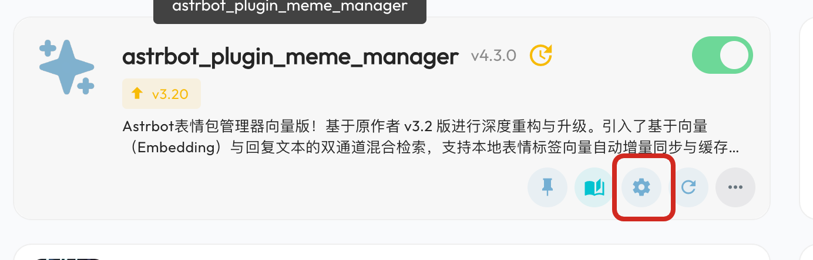
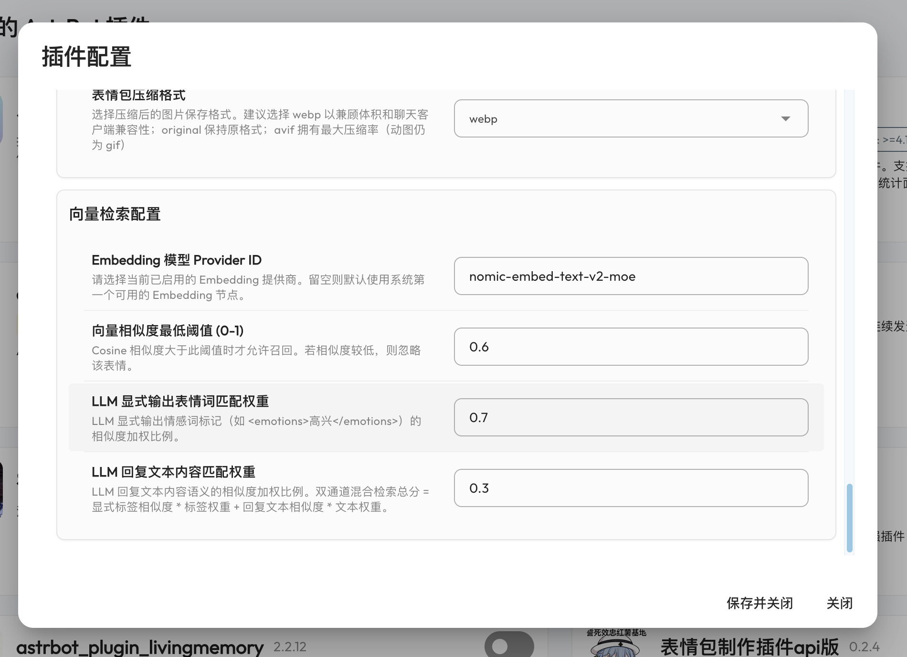
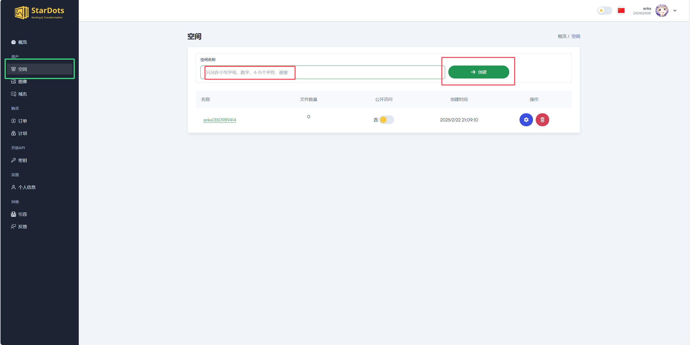
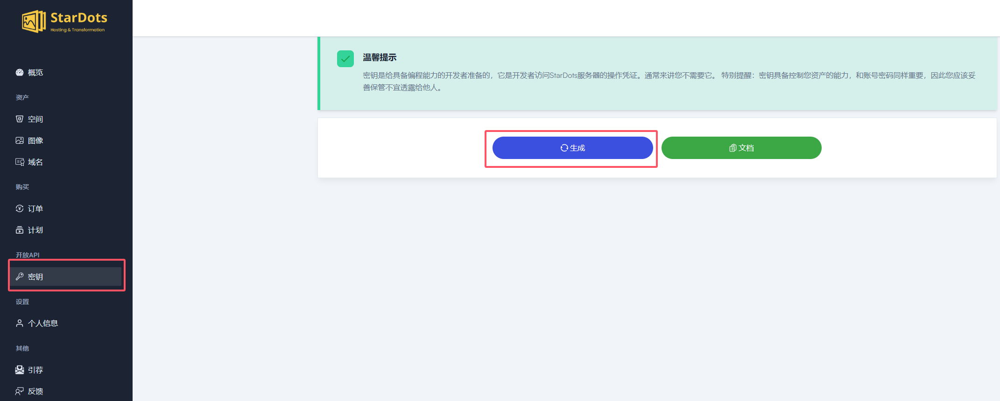
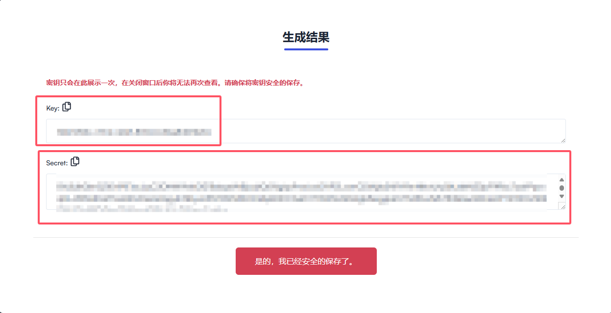
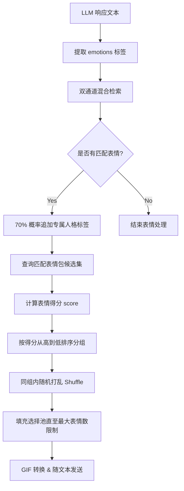
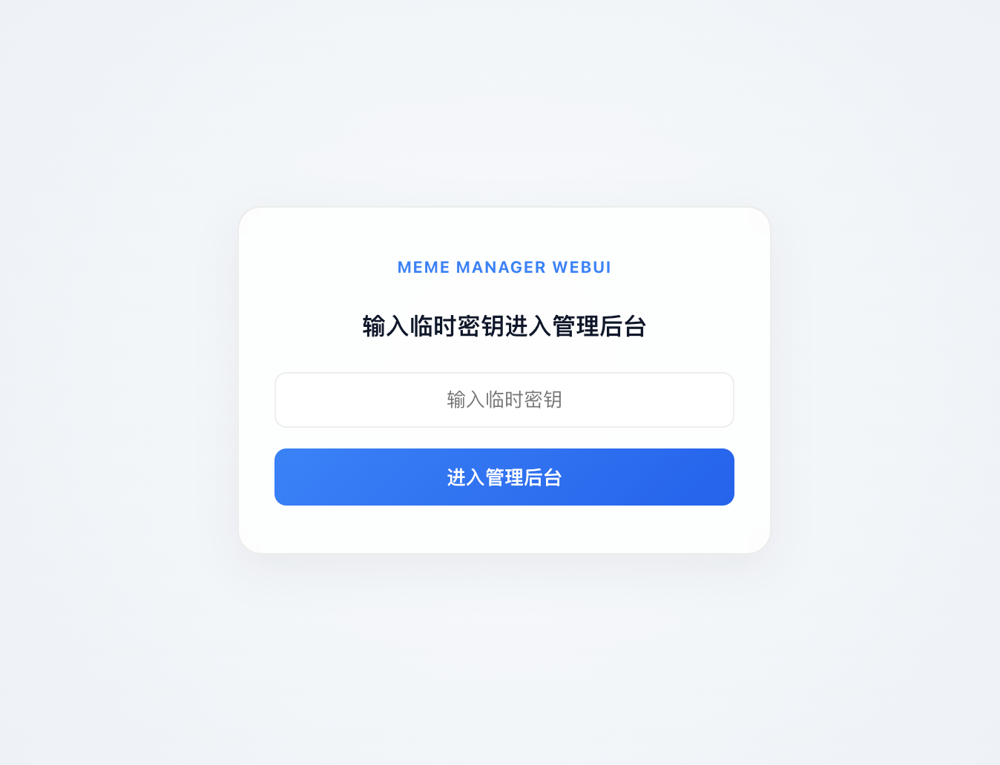
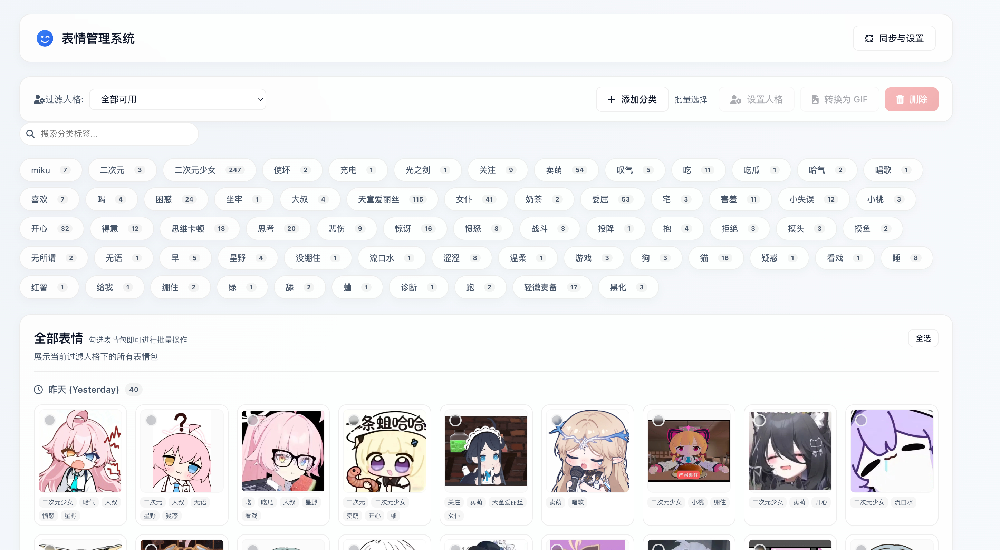

# 🌟 AstrBot 表情包管理器

<div align="center">

[](https://opensource.org/licenses/MIT)


[](CONTRIBUTING.md)
[](https://github.com/Yao-lin101/astrbot_plugin_meme_manager/graphs/contributors)
[](https://github.com/Yao-lin101/astrbot_plugin_meme_manager/commits/main)

</div>

<div align="center">

[](https://github.com/Yao-lin101/astrbot_plugin_meme_manager)

</div>

## 📑 目录

- [🌟 AstrBot 表情包管理器](#-astrbot-表情包管理器)
  - [📑 目录](#-目录)
  - [❓ 常见问题](#-常见问题)
  - [🚀 功能特点](#-功能特点)
  - [📦 安装方法](#-安装方法)
  - [🛠️ 第一次使用](#️-第一次使用)
  - [☁️ 图床配置](#️-图床配置)
  - [⚙️ 配置说明](#️-配置说明)
  - [💡 特色功能说明](#-特色功能说明)
    - [🤖 AI 自动收录 (偷表情包)](#-ai-自动收录-偷表情包)
    - [👤 人格绑定与独立分类](#-人格绑定与独立分类)
    - [📂 重构标签管理系统](#-重构标签管理系统)
    - [🎯 表情选择与过滤判定流程](#-表情选择与过滤判定流程)
  - [📝 使用指令](#-使用指令)
  - [🖥️ WebUI 功能预览](#️-webui-功能预览)
  - [📜 更新日志](#-更新日志)
    - [v4.3.0](#v430)
    - [v4.20](#v420)
    - [v4.10](#v410)
    - [v3.20](#v320)
    - [v3.1x](#v31x)
    - [v3.0](#v30)
    - [v2.2](#v22)
    - [v2.1](#v21)
    - [v2.0](#v20)
    - [v1.x](#v1x)
  - [⚠️ 注意事项](#️-注意事项)
  - [🛠️ 问题反馈](#️-问题反馈)
  - [📄 许可证](#-许可证)

一个功能强大的 AstrBot 表情包管理插件，支持 🤖 AI 智能发送表情、🌐 WebUI 管理界面、☁️ 云端同步等特性。


## ❓ 常见问题

1. **Q: 如何快速开始使用这个插件？有哪些刚需配置？**

   - A: 
     1. 安装插件。
     2. **刚需配置 Embedding 模型**：由于引入了向量双通道检索，您必须在 AstrBot 的服务商设置中，确保配置了至少一个可用的 Embedding 节点，并在本插件配置中正确选择 `embedding_provider_id`（留空则默认使用系统第一个可用的 Embedding 节点）。若无可用 Embedding 模型，向量召回匹配将无法正常运作。
     3. 需要在人格中配置表情收集偏好，详见Q7。

2. **Q: WebUI 无法访问怎么解决？**

   - A: 请按以下步骤排查：
     1. Docker 部署用户请先确保已映射端口，详见：[ISSUE#1](https://github.com/Yao-lin101/astrbot_plugin_meme_manager/issues/1)
     2. 使用内网穿透的用户需配置 NAT 转发，将内网 5000 端口映射到外网
     3. 云服务器用户请检查安全组是否已放行 5000 端口的入站规则

3. **Q: 是否必须配置图床才能使用？**

   - A: 不需要。除了云端同步功能外，其他所有功能（包括表情管理后台）都可以正常使用。图床配置是可选的。

4. **Q: 如何管理表情包？**

   - A: 请先私聊机器人发送命令 `/表情管理 开启管理后台` 启动 WebUI，在管理界面中您可以：
     - 添加/删除表情包
     - 创建/修改表情分类
     - 编辑表情描述（用于指导 bot 使用场景）
     - 拖拽移动表情包、批量选择删除/移动/复制/粘贴
     - 查看图床服务商、云端图片数量和占用空间
       所有修改都会实时生效，无需重启或额外配置。

5. **Q: 插件是否包含预设表情包？**

   - A: 否，这个版本不包含预设表情包，请自行添加，或者开启自动偷图功能，工具会根据偏好自行静默偷取表情包。

6. **Q: 最佳实践是什么？**

   - A: 推荐以下使用流程：
     1. 安装插件后先配置嵌入模型。
     2. 修改人格设置，并添加偏好提示词，详见Q7。
     3. 需要更多自定义设置时，请参考[🛠️ 第一次使用](#️-第一次使用)章节

7. **Q: 如何启用 AI 自动收录 (偷表情包) 功能？为什么提示“未配置表情包收集偏好”？**

   - A: 
     - **启用前提**：需开启配置中的 `auto_steal_enabled`（群聊被动偷图）或由 LLM 触发 `steal_meme` 工具。
     - **配置偏好（刚需）**：为了控制收录内容，当前会话人格的系统提示词（System Prompt）中**必须**配置被 `<meme_preference>` 标签包裹的收录偏好。
     - **配置示例**：
       ```xml
       <meme_preference>
       - 允许范围：女仆侍奉、笨拙打扫、美味食物、极度可爱、干劲满满。
       - 绝对禁止：阴暗、暴力、血腥、带有强烈攻击性或过于抽象死宅风格。
       - 选图策略：偏向温和治愈，用于展示自己正在努力进行女仆修行。
       </meme_preference>
       ```
     - **拦截机制**：此偏好设置将同时作用于**群聊被动暗中偷图**与**主动 LLM 偷图工具**。即便用户通过上下文绕过了 Bot 的前置判断（例如强行命令 Bot 偷某张违规图），收录工具下载图片后仍会调用多模态模型进行审核判定，如果不满足偏好范围或命中了绝对禁止项，仍会被底层工具强制拦截并拒绝收录。

8. **Q: 为什么使用向量检索匹配？**

   - A: 引入基于 Embedding 向量的标签与对话文本双通道混合检索，识别与发送更精准自然，表情包的标签可以无限膨胀，不再需要在系统提示词中注入大段分类、描述等内容，llm可以直接输出几个大概的标签就能匹配到相关的表情包。

## 🚀 功能特点

| 功能                    | 描述                                                                 |
| ----------------------- | -------------------------------------------------------------------- |
| 🤖 AI 向量智能检索匹配  | 引入基于 Embedding 向量的标签与对话文本双通道混合检索，识别与发送更精准自然 |
| 📸 AI 自动收录 (偷图)   | 提供 LLM Tool 接口与多模态自动分类，智能自动偷取/收录表情并按语义分类保存 |
| 👤 人格分类与绑定       | 表情包支持绑定到特定人格，不同人格在对话中只会发送自己专属的表情包   |
| 📂 表情包格式与格式保护 | 表情输出格式升级为 `<emotions>` 标记，且输出格式说明在代码底层硬编码拼接，保障可靠性 |
| 🌐 WebUI 管理界面       | 提供可视化 WebUI 界面，支持按时间分级展示（今天/昨天/最近一周/更早以前）、批量导入 |
| 🖼️ 快速上传和管理表情包 | 通过命令快速上传和管理表情包，WebUI 上传时可直接看到上传进度与结果    |
| ⚡ 标签向量自动增量同步 | 后台自动增量计算缺失标签的向量并同步，且支持管理员指令手动重构缓存   |
| ☁️ 云端图床同步         | 支持与云端图床同步，方便多设备使用，并展示当前图床服务商与云端统计信息 |
| 🔒 安全的访问控制机制   | 管理后台仅允许私聊开启，危险命令与危险操作均带确认流程               |
| 📊 表情发送控制         | 可以控制每次发送的表情数量和频率以及触发概率                         |

## 📦 安装方法

1. 确保已安装 AstrBot
2. 将插件复制到 AstrBot 的插件目录（你也可以使用 Astrbot 的插件管理器安装，或下载本项目上传压缩包）
3. 重启 AstrBot 或使用热加载命令

## 🛠️ 第一次使用

注意：第一次使用请先进行配置，配置步骤如下：

1. **打开设置**：进入设置界面，如图所示：
   

2. **进行设置**：根据以下说明进行配置，你也可以点击问号了解配置说明：
   

   > **注意**：你需要设置好图床的 API Key、API Secret 和空间名称，才能正常使用图床同步等功能。如果不设置图床信息，默认无法使用图床功能，其他功能如 WebUI 可以正常使用。

## ☁️ 图床配置

本插件支持 **stardots** 和 **Cloudflare R2** 两种图床。

### 方案一：Stardots 图床（国内访问友好）

1. **注册账号**：如果没有账号，你需要先注册一个 stardots 账号，或直接使用其他方式登录。

   > Stardots 图床免费账户支持 1 个空间，2024 张图像（对于表情包来说是足够的），每月 10GB 流量传输。免费账户对于我们同步存储表情包的需求来看是足够的。

2. **建立空间**：注册账号后，你需要先建立一个空间，操作如图所示：
   

   > 记住你建立的空间的名字，将其填入插件设置中的图床配置信息的空间名称中。

3. **获取 API Key 和 API Secret**：在同样的界面，点击左侧的"开放 API" -> "密钥"，点击生成密钥：
   

   你会看到如下画面：
   

   将其中的 API Key 和 API Secret 填入插件设置中的图床配置信息中，点击保存配置，AstrBot 将会重启。

### 方案二：Cloudflare R2 图床（国际访问友好）

1. **创建 Cloudflare 账号**：如果还没有账号，请先注册 Cloudflare

2. **创建 R2 存储桶**：
   - 登录 Cloudflare Dashboard
   - 进入 R2 页面
   - 点击 "Create bucket" 创建存储桶
   - 记住存储桶名称，填入配置中的 `bucket_name`

3. **获取 R2 API 凭证**：
   - 在 R2 页面，点击 "Manage R2 API Tokens"
   - 点击 "Create API Token"
   - 记录生成的 `Access Key ID` 和 `Secret Access Key`
   - 在 R2 页面右上角可以找到 `Account ID`

4. **配置插件**：在插件设置中选择 `cloudflare_r2` 并填写：
   ```yaml
         # Cloudflare Account ID (account_id)
         account_id: "your_account_id"
         # R2 Access Key ID (access_key_id)
         access_key_id: "your_access_key_id"
         # R2 Secret Access Key (secret_access_key)
         secret_access_key: "your_secret_access_key"
         # R2 Bucket 名称 (bucket_name)
         bucket_name: "your_bucket_name"
         # 自定义CDN域名 (可选) (public_url)
         # 例如: https://你的域名.com
         public_url: "https://你的域名.com"
   ```

5. **开启公共访问**（可选）：
   - 在存储桶设置中，可以绑定自定义域名
   - 或者使用默认的 R2.dev 域名（`https://<bucket>.<account_id>.r2.dev`）
   - 将域名填入 `public_url` 配置项

6. **使用图床功能**：
   - 发送 `/表情管理 同步状态` 查看同步状态
   - 发送 `/表情管理 同步到云端` 上传表情包到R2
   - 发送 `/表情管理 从云端同步` 从R2下载表情包

> **Cloudflare R2 优势**：
> - 每月10GB免费存储
> - 每月100万次免费A类操作
> - 全球CDN加速
> - 支持自定义域名
> - 智能上传记录，避免重复上传相同文件

## ⚙️ 配置说明

插件配置项包括：

- `image_host`: 选择图床服务 (支持 stardots 和 cloudflare_r2)
- `image_host_config`: 图床配置信息（根据选择的图床服务填写相应配置）
- `webui_port`: WebUI 服务端口号
- `max_emotions_per_message`: 每条消息最大表情数量
- `emotions_probability`: 表情触发概率 (0-100)
- `enable_mixed_message`: 启用回复带图功能
- `mixed_message_probability`: 回复带图概率 (0-100)
- `auto_steal_enabled`: 是否启用群聊被动暗中偷表情包
- `auto_steal_probability`: 自动偷表情包的触发概率（范围 1-100）
- `auto_steal_min_seen`: 触发多模态偏好判定所需图片的全局最少出现次数（默认 2 次，用以有效过滤一次性截图、照片和插画）
- `multimodal_tag_prompt`: 自动分类标签生成提示词（用于指导多模态分类分析时的标签提炼维度，格式限制会在后台自动拼接）
- `embedding_provider_id`: Embedding 模型 Provider ID（留空则默认使用系统第一个可用的 Embedding 节点）
- `embedding_similarity_threshold`: 向量相似度最低阈值 (0-1)，Cosine 相似度大于此阈值时才允许召回，低于此阈值将被忽略
- `embedding_tag_weight`: LLM 显式输出情绪词（如 `<emotions>高兴</emotions>`）的相似度加权比例
- `embedding_text_weight`: LLM 回复文本内容语义的相似度加权比例（双通道混合检索总分 = 显式标签相似度 * 标签权重 + 回复文本相似度 * 文本权重）


### ⚠️ 重要提示

**分段回复兼容性：**
- 如果您在 AstrBot 配置中开启了 **分段回复** 功能，回复带图功能可能会失效
- 这是由于分段回复机制会将消息组件逐个发送导致的
- 如需完整的回复带图体验，请考虑关闭分段回复功能

## 💡 特色功能说明

### 🤖 AI 自动收录 (偷表情包)
本插件内置了 `steal_meme` LLM 工具（通过 `llm_tool` 注册）。当用户说“收录这张表情包”或“把这张图偷到 happy 分类”时，大模型将智能调用该工具，自动下载上一条消息中出现的图片，并将其自动保存和注册到对应的人格表情包分类库中。
- 只有当用户在指令中明确指定了具体分类名称（例如“收录到 happy 分类中”）时，才传入对应类别。
- 若未明确指定，则默认收录为通用表情，稍后您可在 WebUI 中对其手动归类或分配人格。

### 👤 人格绑定与独立分类
为了让多个人格共存时表现更加自然独立，我们支持了表情包人格属性：
- 表情包可以设置为仅对一个或多个人格有效，不同人格在对话中只会触发自己专属的表情分类。
- 支持在 WebUI 中快捷编辑表情包适用的“人格列表”（如 `default` 或自定义人格 ID）。
- 支持完善的 fallback 降级机制：若当前对话会话的人格未指定，插件将自动读取 AstrBot 的默认人格设置（`provider_settings.default_personality`），让表情分类判定更加准确。

### 📂 重构标签管理系统
- **模糊匹配 OR 逻辑**：重构了表情包分类匹配机制，将 SQLite 查询语句优化为 `LIKE` 模糊匹配。对于含有多个标签的表情包，只要其中任意一个标签命中即可加入随机池，避免了以往必须全部命中才触发的问题。
- **WebUI 全部 (All) 视图**：在管理后台添加了“全部 (All)”标签页，集中展示当前选择人格下的所有表情包，方便用户进行批量删除、复制或重命名等操作，且在该视图下自动隐藏上传和排序以防误操作。

### 🎯 表情选择与过滤判定流程

本插件的表情包选择与过滤采用了**大模型情绪提取**、**双通道向量混合检索**、**专属人格标签追加**、**加权得分计算评分机制**的完整链路，确保机器人发送的表情包高度契合上下文语境，同时具备多样性与人格特征。

整个筛选与决策流程如下：



#### 1. 标签提取与双通道检索
- **LLM 情绪输出**：LLM 响应文本中会包含形如 `<emotions>开心,得意</emotions>` 的情绪标签。
- **精确匹配 (Exact Match)**：首先对待选的 raw tags 进行比对，若完全匹配当前人格支持的已有表情标签，则直接采纳。
- **向量相似度匹配 (Vector Similarity)**：若未精确匹配，则将 raw tags 针对所有候选标签进行向量化比对；同时，如果配置了文本权重（`embedding_text_weight` > 0），也会对回复的纯文本（去掉表情标签后的文本）进行向量化匹配。
- **混合评分计算**：
  $$ \text{综合得分} = \frac{\text{标签最大相似度} \times \text{标签权重} + \text{文本相似度} \times \text{文本权重}}{\text{标签权重} + \text{文本权重}} $$
  将所得综合得分与阈值（`embedding_similarity_threshold`，默认 0.6）进行比对，保留满足阈值的标签，最终获取向量召回的标签。

#### 2. 追加专属人格标签
- **专属标签机制**：如果检索出至少一个有效标签，则有 **70%** 的概率将当前会话人格的“专属标签”（`dedicated_tag`）追加到最终检索的标签列表中。这保证了不同人格能够高频带上其专属的情绪倾向（例如某傲娇人格追加“傲娇”，可爱人格追加“卖萌”）。

#### 3. 表情池评分过滤与筛选 (Score Calculation)
对于从数据库查询出的符合当前人格、且包含至少一个最终匹配标签 of 表情包候选集，进行加权得分评分：
- **基础得分 (Matched Count Score)**：表情包的标签每命中一个已识别出的情绪标签（不含专属标签），得 **1000** 分：
  $$ \text{Matched Score} = \text{matched\_count} \times 1000 $$
- **位置偏置得分 (Position Bonus)**：标签在 LLM 输出的情绪词中越靠前，加分越高：
  $$ \text{Position Bonus} = \sum_{e \in \text{matched}} \max(0, 100 - \text{index}_e) $$
- **专属标签得分 (Dedicated Bonus)**：若表情包包含当前人格的专属标签，额外加 **500** 分：
  $$ \text{Dedicated Bonus} = 500 \quad (\text{若包含专属标签}) $$
- **最终得分公式**：
  $$ \text{Score} = \text{Matched Score} + \text{Position Bonus} + \text{Dedicated Bonus} $$

#### 4. 排序与多态推荐
- **分组与去重排序**：将所有候选表情包按照最终得分从高到低进行分组。
- **同分随机 (Shuffle)**：为避免重复发送同一张图，对同一得分组内的表情包列表进行**随机打乱**。
- **数量限制**：从得分最高的分组开始填充选择池，直至达到单条消息允许的最大表情数（`max_emotions_per_message`）上限。

## 📝 使用指令（部分旧指令可能失效，建议使用webui）

| 指令                              | 描述                                        |
| --------------------------------- | ------------------------------------------- |
| `/表情管理 查看图库`              | 📚 列出所有可用表情类别                     |
| `/表情管理 添加表情 [类别]`       | ➕ 添加新表情到指定分类                     |
| `/表情管理 开启管理后台`          | 🚀 启动 WebUI 服务，仅支持私聊使用          |
| `/表情管理 关闭管理后台`          | 🔒 关闭 WebUI 服务                          |
| `/表情管理 恢复默认表情包 [类别]` | ♻️ 恢复内置默认表情包，可指定单个类别       |
| `/表情管理 清空指定类型 [类别]`   | ⚠️ 清空指定类别中的表情包，保留类型本身     |
| `/表情管理 清空全部`              | ⚠️ 清空全部表情包，保留所有类型和描述配置   |
| `/表情管理 删除类型本身 [类别]`   | ⚠️ 删除指定类型及其描述配置                 |
| `/表情管理 同步状态`              | 🔄 检查同步状态                             |
| `/表情管理 同步到云端`            | ☁️ 将本地表情同步到云端                     |
| `/表情管理 从云端同步`            | ⬇️ 从云端同步表情到本地                     |
| `/表情管理 覆盖到云端`            | ⚠️ 让云端与本地完全一致                     |
| `/表情管理 从云端覆盖`            | ⚠️ 让本地与云端完全一致                     |
| `/表情管理 重构向量缓存`          | ⚡ 清空本地缓存的标签向量并重新同步计算     |

> 说明：
> - `开启管理后台` 只能在私聊中执行；重复执行时会直接返回当前访问信息，不会重复启动。
> - `清空指定类型`、`清空全部`、`删除类型本身` 都需要在 30 秒内二次确认。
> - `恢复默认表情包` 不会覆盖现有文件；同内容文件会跳过，同名不同内容会自动补序号。

## 🖥️ WebUI 功能预览

以下是 WebUI 的功能预览：

| 功能           | 预览图示                                                      |
| -------------- | ------------------------------------------------------------- |
| 登录界面       |                  |
| 表情包管理界面 |  |

## 📜 更新日志

### v4.3.0

- 🤖 **向量检索与双通道匹配（核心升级）**：
  - 全新引入基于 Embedding 的标签与回复文本双通道混合匹配检索机制，彻底升级了原有的关键字启发式匹配、松散匹配和旧版情感模型识别逻辑。
  - 显式标签匹配与回复文本语义匹配总分进行加权混合计算（支持自定义设置各自的加权比例），使表情包的发送和语气更契合、更精准。
  - 新增本地分类标签向量数据库维护，在插件启动或标签变更时，在后台自动增量向 Embedding 节点发起向量计算并进行同步。
  - 新增管理员指令 `/表情管理 重构向量缓存`，支持清空缓存的标签向量并强制重新计算和同步。
- ⚙️ **配置与提示词格式保护**：
  - 移除了“表情包系统提示词”配置项中包含的 `<emotions>` 格式等具体说明，改为在代码底层加载时拼接，防止用户自定义修改提示词时损坏格式规范。
  - 新增多模态自动分类标签提示词 `multimodal_tag_prompt` 可配置项，用于自由定制多模态分类标签提炼维度，同时格式要求（JSON 数组）由系统自动在后端拼接。
  - 优化表情包发送行为指引的默认文本与限制规范，鼓励生成 2-5 个更丰富具体的标签，同时放宽了对外部搜索工具的绝对禁用限制（改为克制使用，除非用户十分明确要求搜索）。
- 🎨 **标记语法升级**：
  - 表情包标记语法格式全面升级，由原本的 `&&标签&&` 变更为更易识别且不易冲突的 `<emotions>标签</emotions>` 格式。

### v4.20

- 🤖 **AI 被动暗中偷表情包**：新增了通过多模态模型被动收录群聊表情包功能，支持自主设定触发概率，并可以通过全局看见次数阈值 `auto_steal_min_seen`（默认 2 次）智能过滤一次性的截图、日常插画/照片等无关背景，极大节约 LLM 的 Token 开支。
- 👤 **人格专属标签**：支持在 WebUI 为不同人格绑定专属标签，在完成情绪提取后有 70% 概率智能拼接进最终检索标签列表（保留 30% 多样性不拼接），使发送表情包更符合当前人格调性。
- 📂 **WebUI 表情分级展示**：
  - WebUI 所有分类及“全部 (All)”页面新增了按新增时间分级展示功能（今天、昨天、最近一周、更早以前），且列表内按添加时间由新到旧排序，极大方便手动打标签管理。
  - 将原有的网格上传卡片重构为位于分类最顶部的通栏 dotted 上传区域，排版更美观。
  - 新增“批量导入表情”弹窗及多分类表情合并导入逻辑，并优化了 checkbox 在部分浏览器下受 button padding 挤压变形的问题。
- 🐛 **修复与优化**：修复了在收录自定义新标签时因拼写错误导致 UnboundLocalError 的 Bug；优化了多模态模型分析 Prompt，对插画、截图和照片建立更清晰的负样本规则。

### v4.10

- 📸 **AI 自动收录 (偷图)**：新增了 `steal_meme` LLM 工具支持，允许机器人自动识别收录表情的聊天指令，自动提取上一条消息的图片并存入当前人格所属的分类库中。
- 👤 **人格分类与绑定**：支持表情包的人格绑定，不同人格只会发送自己专属的表情包；增加会话人格 fallback 机制，保证默认人格判定顺畅。
- 📂 **重构标签匹配与管理**：
  - 重构了标签分类匹配机制，支持多标签 OR 逻辑（匹配任意一个标签即触发），且底层 SQLite 模糊查询使用通配符优化，解决多人格、多标签表情包无法匹配的问题。
  - WebUI 中新增了 **全部 (All)** 分类展示页，可直接浏览所选人格下的所有表情包，支持批量跨分类删除与批量右键等功能。
- 🔧 **代码重构与优化**：重构了大部分后端逻辑脚本，使用 `pathlib.Path` 进行路径操作，优化数据迁移和兼容性，完美适配 AstrBot v4.x 的数据规范（落在 `data/plugin_data/meme_manager/` 下）。

### v3.20

- 🗂️ 插件大文件存储切换到 AstrBot 规范的 `data/plugin_data/meme_manager`
- 🔄 兼容旧版 `data/memes_data` 目录并在首次加载时安全迁移
- ✅ WebUI 新增批量删除、分类清空、全量清空与 5 秒二次确认
- 💬 将主要 `alert/confirm` 交互替换为页内提示与统一确认弹层
- 🔐 管理后台改为仅允许私聊开启，重复开启/关闭时只返回单次最终结果
- 🧾 命令组新增 `清空指定类型`、`清空全部`、`删除类型本身`，并接入 AstrBot 会话控制二次确认
- 📤 WebUI 上传新增可见进度、批次状态提示与批量内去重；同内容文件会跳过，同名不同内容会自动补序号
- 🖱️ WebUI 支持批量右键菜单、拖拽移动、批量复制粘贴、分类编辑弹窗与移动端侧栏/滚动适配
- ☁️ 图床状态面板新增当前服务商、云端图片数量与云端占用展示
- 🛠️ 修复添加分类后同步状态检查异常，兼容不同同步状态返回结构
- 🧰 默认表情包仅在首次初始化时自动导入一次，后续更新不再自动补回已删除的默认内容
- ♻️ 新增 `/表情管理 恢复默认表情包 [类别]`，支持按类别或全部恢复内置默认表情包

### v3.1x

- 🛠️ 修复 AstrBot 4.5.0+ 版本兼容性问题，解决表情标签过滤异常
- 💡 新增宽松匹配模式, 备用标记匹配, 重复表情检测, 高置信度表情设置
- 🛠️ 修复 webui 中的上传, 我是猪鼻
- 🛠️ 提供 webp 格式支持
- ☁️ 新增 Cloudflare R2 图床支持（智能上传记录，避免重复上传）
- 🖼️ 新增回复带图功能：文本和表情图片可在同一条消息中发送
- 🎛️ 新增回复带图概率控制，让表情包行为更自然
- 📊 增强同步状态命令，支持详细参数查看文件分类统计
- 🔄 修复 MessageChain 迭代错误和 R2 图床同步前缀问题

### v3.0x

- 🛠️ 修复消息类型不支持查看问题
- 🎉 移除了 imghdr 依赖, 现在兼容更高版本 python

### v3.0

- 🔄 完全重构代码架构
- 🌟 新增 WebUI 管理界面
- ☁️ 添加图床同步功能
- 🤖 优化表情识别算法

### v2.2

- 🎉 增加更多表情包
- 🛠️ 修复 TTS 兼容性问题

### v2.1

- ⚡ 优化消息发送逻辑
- ✉️ 文本和表情分开发送

### v2.0

- 🌐 支持网络图片上传
- 🔧 优化上传流程

### v1.x

- 🚀 初始版本发布
- 📦 基础表情管理功能
- 🖼️ 多图上传支持

## ⚠️ 注意事项

1. WebUI 服务需要管理员权限才能开启
2. 使用云端同步功能前需要正确配置图床信息
3. 请勿将 WebUI 访问密钥分享给未授权用户
4. 这版插件对webui做了很大优化，由于过于依赖webui导致一直没有更新管理员指令，指令可能存在错误，请自行测试

## 🛠️ 问题反馈

如果遇到问题或有功能建议，欢迎在 GitHub 提交 Issue。

## 📄 许可证

本项目基于 MIT 许可证开源。
